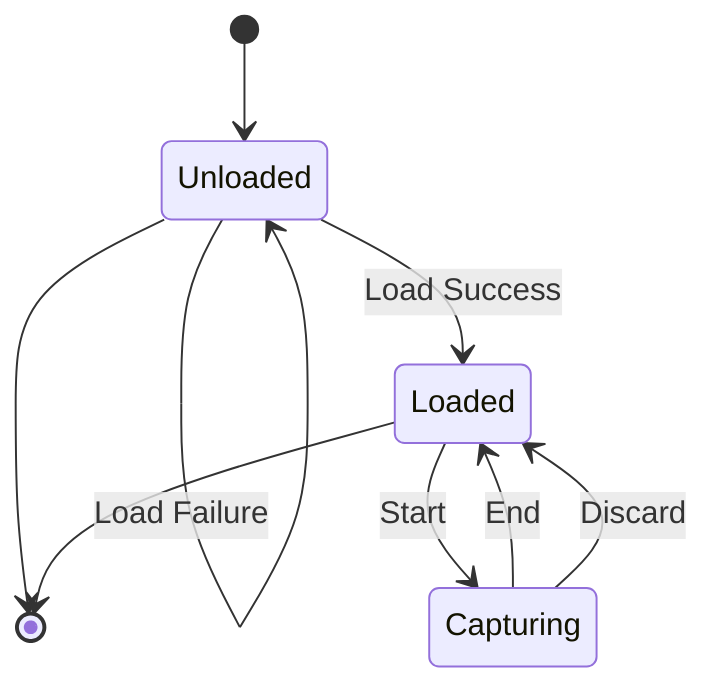
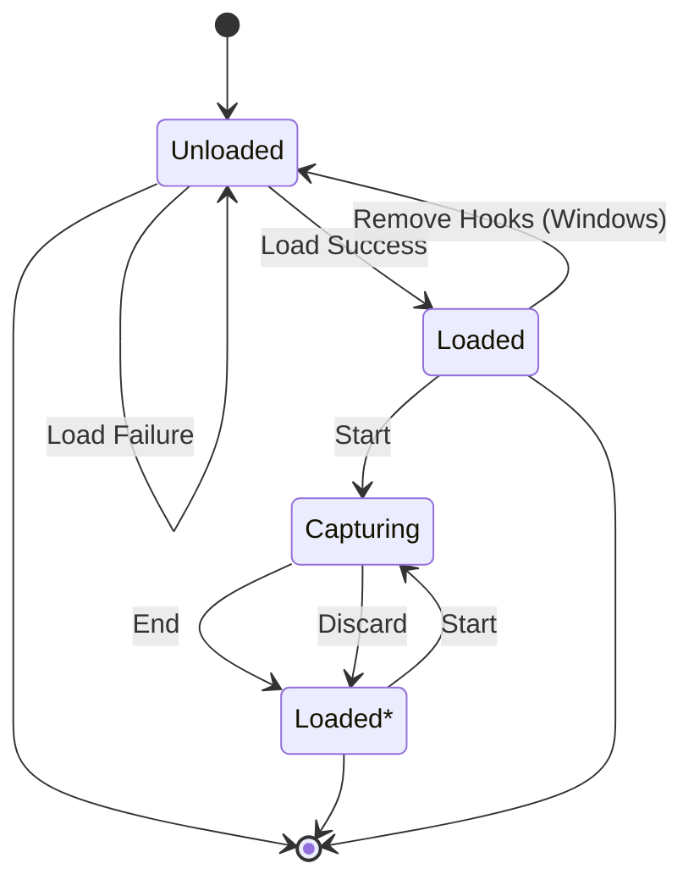

# Idiomatic RenderDoc API design document

## Requirements

What does this need to do? What functionality does the RenderDoc in-app API
provide? Let's list, in no particular order:

1. Create frame captures
   * Wait till the next frame is presented to the global "current" window
   * Same as above, but can set up for multiple frames
   * Create a frame capture with an explicit start/end and device/window combo
   * Discard an ongoing frame capture; same as "end" but doesn't save to disk
   * Globally set a "capture title" to show in UI (can only be called during
     a capture or else has no effect)
   * Frame captures have a "path template" format to determine where they're
     saved and the filename prefix
2. Configure capture options (numeric or bool)
   * Can we do this while a capture is running? Seems wrong to allow this.
3. Display a debug overlay over your content
   * Settings: enabled/disabled, frame metric counters, frame number counter,
     recent capture list w/total counter
   * Customized using a bit mask
4. Listen for user-defined keystrokes to:
   * Trigger a capture on the next frame presented to the "current" window
   * Toggle focus between render windows, if your app has multiple windows
5. List all captures created since app start
   * Number of total captures
   * File path + timestamp
   * Retrieve by index and iterate
6. Set arbitrary "comments" in a capture file (by path) to show in UI when
   opening the capture file
7. Launch the replay UI
   * Connect app to UI immediately (probably should be set by default)
   * When launching, specify custom command-line arguments at launch, e.g. a
     capture filename
   * If the replay UI is running and is connected to the app, trigger focus so
     the replay UI jumps to the top above all other windows screen
8. RenderDoc automatically loads a crash handler; should be able to opt-out
9. Shut down and remove the RenderDoc hooks from the program (only on Windows)

## API Properties

* Request a specific version of the API as early as possible in the program,
  receive a function table.
* Semver compatibility is important. Make sure we don't call incompatible
  methods.
* Most API calls should be safe to call from any thread, but is not thread-safe
  (`Send`, but `!Sync`). This includes initialization.
* Proving something safe requires a really, _really_ high bar. For example,
  `start_frame_capture()` must be deemed unsafe unless the following invariants
  are upheld:
  * No other frame captures are ongoing.
  * The device handle is valid (points to real device, device is also not lost).
  * The window handle is valid.
  * If there is _only one_ device present, it's okay to pass a `NULL` handle.
  * If there is _only one_ window present, it's okay to pass a `NULL` handle.
* Should we allow multiple instances of the `RENDERDOC_API_.*` struct to exist
  at the same time? Technically fine, but it could trivially break many
  invariants, so we'll call this unsafe.
* See this quote for intended usage:

  > The recommended way to access the RenderDoc API is to passively check if the
  > module is loaded, and use the API if it is. This lets you continue to use
  > RenderDoc entirely as normal, launching your program through the UI, but you
  > can access additional functionality to e.g. trigger captures at custom
  > times. When your program is launched independently it will see that the
  > RenderDoc module is not present and safely fall back.

  This means that safe fallback, if RenderDoc isn't running, should be possible
  to handle. How should we handle this ergonomically?
  * `Result<T, E>` on init? Works today, but is cumbersome in a singleton. E.g:
    `static RENDERDOC: Lazy<Mutex<Result<RenderDoc<V110>, Error>>> = ...;`
  * We may have to conditionally make all method calls no-ops depending on
    whether RenderDoc is loaded? Seems ridiculous to me.

## Brainstorming

Let's get more concrete. What do we need?

1. Some strongly versioned entry point into the RenderDoc API.
   * Downgrading is still useless. Not sure why `master` includes this feature.
   * Upgrading by checking the version at runtime might be useful. Glad the
     current in-progress `improve-api-ergonomics` branch includes this.
     * Wondering how ergonomic this can be inside a singleton, though.
     * Will require some way to `.take()`, try to upgrade, and `.replace()` the
       singleton.
     * Type in singleton and new upgraded versions don't match anymore, so it
       can't be reinserted into the singleton.
     * Maybe you could query the current version at runtime _on the method_
       rather than on the API instance? Consider a design where you specify a
       minimum version, where methods unavailable in that version still exist,
       but become fallible?
   * Try to avoid mapping _too_ closely to the actual RenderDoc API, which was
     designed for C and not Rust.
     * Focus on making the API as ergonomic and idiomatic as possible.
     * Don't rename methods or types when switching from e.g. `V100` and `V160`.
       Who cares about that? Instead, show the newest versions of everything to
       the user and call into the old deprecated functions internally, if the
       selected version calls for it.
     * Continue to gate access to methods only available on specific versions.
2. Some way to store the instance of the RenderDoc API as a global.
   * Not a fan of singletons, but we must enforce this to keep the API safe.
   * How to handle fallibility when in a singleton?
     * Not a bad idea to just keep using `Result`, IMO.
   * Also, what about internal synchronization? Having a mutex inside is
     wasteful, sure but `RENDERDOC_GetAPI` isn't reentrant and already needs a
     synchronization primitive to be safe...
   * Maybe provide a `ResultExt` trait implemented for
     `Result<Mutex<RenderDoc<V>>, Error>`? This could make singletons nicer.
3. Some flow for customizing the capture options and then triggering a capture.
   * Should we do this once, and then never again? (return a new type after
     configuration for creating/listing captures) Or should runtime
     reconfiguration of the capture options be allowed?
   * I'm leaning towards the latter... I could imagine a user toggling certain
     options on and off in between taking captures.
   * Don't think we should allow users to change capture settings _while_ a
     capture is ongoing. Seems weird and possibly broken to allow this.
   * Also, I doubt `start_frame_capture`/`end_frame_capture` can _ever_ be made
     safe. Perhaps a closure-based API might be?
     * `fn capture_frame<T>(&mut self, dev, win, f: impl FnOnce() -> T) -> T`
     * Nope! A device handle of `None` and/or window handle of `None` is unsafe.
     * This would be 100% safe only if all these criteria are met:
       1. No other captures are ungoing.
       2. Device handle is well-defined (type from `wgpu`, `glutin`, or similar)
          and refers to a graphics device that is _still alive_.
       3. Window handle is well-defined (type from `winit` or similar) and
          refers to a window that is _still alive_.
          * Calling `set_active_window` with a well-defined type and passing
            `None` to `capture_frame` is still unsafe! What if the window the
            handle refers to is destroyed before `capture_frame` is called? The
            wildcard lookup will inevitably fail, in that case.
          * We could resolve this issue by keeping a copy of the active window
            handle internally and checking its liveness within `capture_frame`
            before making the API call. `capture_frame` would return `Err(_)` if
            the active window handle is invalid.
          * Not sure all this extra effort is worth it...
4. When not capturing actively, we should be able to list existing captures.
5. Some way to customize the debug UI.
6. Some way to set global capture and focus keys.
   * Should we allow configuration of this during a capture? Or being able to do
     it at any time, not just on startup?
   * Conceptually, forcing these settings to be set only on startup makes sense
     to ensure a sequential step-by-step flow to the API, but this doesn't sound
     like a good idea when the hotkeys assigned might conflict with others as
     the application progresses.
     * For example, you get to a text box and need to type arbitrary text. You
       should be able to switch off the hotkeys so the user doesn't trigger
       captures accidentally.
     * Another example: imagine a game that changes states from one state to
       another (e.g. main menu to game). The hotkey set before the main menu
       didn't conflict before, but now it does in the main game. We should be
       able to switch to a different capture/focus key at that point.
     * Sounds like we should be able to reconfigure the hotkeys at any time, but
       probably not a good idea to allow this while capturing, though.
7. Some way to add comments to a capture file.
   * For some bizarre reason, the original API doesn't use indices for this
     purpose?
     * I guess the file path isn't guaranteed to exist, because it may have been
       deleted in the UI, so the indices aren't the best to use here. But then,
       why not just accept indices and return an error if the file's deleted?
   * This lets you add comments to _any_ capture file, regardless of whether it
     was created during this session or if it is even a capture of this app.
   * Do we want to support this level of extreme flexibility? I'm leaning towards
     "no" because it would be weird to allow RenderDoc-integrated apps to modify
     capture files of other RenderDoc-integrated apps saved elsewhere on disk.
8. A global shutdown that is marked `unsafe`, consumes `self`, and works only on
   Windows.
9. A way to launch the replay UI when we're not actively capturing frames.
   * Also some way to focus the replay window, if it's running and connected.
   * Still confused why this feature is necessary... Apps are supposed to skip
     loading the RenderDoc lib if not launched through the replay UI, so why
     would we need to launch it again?
     * The `LaunchReplayUI` function seems to be meant for opening a new
       instance of RenderDoc with a capture file open.
   * Maybe to make things easier to understand and more strongly typed, we could
     have a `std::process::Command`-like args builder for launching the replay
     UI? For example, we could have specific args/methods for specifying e.g. a
     capture file to open (pehaps `AsRef<Path>`? `&Capture`? or maybe have
     `Capture`/`&Capture` implement `AsRef<Path>`?) and/or a .py script to run.
     * I would prefer to avoid opening capture files that don't belong to the
       open application; it's likely best for `LaunchReplayUI` to accept an
       optional `&Capture` instead of raw paths.
   * Should we have `connect_to_application` enabled by default or not?
     * Depends on whether we are opening a capture from the current application
       or one from another application.
10. Finally, there should be a way to check the current version of the API at
    runtime.
    * Is a simple tuple of `(u8, u8, u8)` enough? Or should we create a newtype
      that is `PartialOrd` with our requested version?

## Mockups

### Basic frame capture flow

```rust
use renderdoc::{Error, RenderDoc, V160};

// Set up context here...

let mut renderdoc: Result<RenderDoc<V160>, Error> = RenderDoc::<V160>::new();

if let Ok(renderdoc) = renderdoc.as_mut() {
    renderdoc.set_focus_toggle_keys(InputButton::F);
    renderdoc.set_capture_keys(InputButton::C);
    renderdoc.set_active_window(...);
}

loop {
    // Update simulation here...

    if let Ok(renderdoc) = renderdoc.as_mut() {
        unsafe { renderdoc.start_frame_capture(None, None); }
    }

    // Draw frame here...

    if let Ok(renderdoc) = renderdoc.as_mut() {
        let _ = unsafe { renderdoc.end_frame_capture(None, None); }
    }
}
```

### Handling errors

#### Option 1: Result, perhaps with Extension trait

```rust
pub struct RenderDoc<V: Version> { ... }

impl<V: Version> RenderDoc<V> {
    pub fn new() -> Result<Self, Error> { ... }

    // All other methods here...
}

// Maybe include the extension trait below too?

pub trait ResultExt {
    unsafe fn start_frame_capture<D, W>(&mut self, device: D, window: W)
    where
        D: AsDeviceHandle,
        W: AsWindowHandle;

    unsafe fn end_frame_capture<D, W>(&mut self, device: D, window: W) -> Result<(), Error>
    where
        D: AsDeviceHandle,
        W: AsWindowHandle;

    // Several other common methods...
}

impl<V: Version> ResultExt for Result<RenderDoc<V>, Error> { ... }
```

#### Option 2: Internal fallibility

```rust
pub struct RenderDoc<V: Version> { ... }

impl<V: Version> RenderDoc<V> {
    // Panics if already loaded, but otherwise is silent.
    pub fn new() -> Self { ... }

    pub fn get(&self) -> Result<&Instance<V>, &Error> { ... }
    pub fn get_mut(&mut self) -> Result<&mut Instance<V>, &Error> { ... }
    pub fn is_loaded(&self) -> bool { ... }
}

pub struct Instance<V: Version> { ... }

impl<V: Version> Instance<V> {
    // All other methods here...
}
```

#### Option 3: Wrapper types for different use-cases

```rust
pub struct RenderDoc<V: Version> { ... }

impl<V: Version> RenderDoc<V> {
    // Same semantics as current `renderdoc-rs`
    pub fn new() -> Result<Self, Error> { ... }

    // Panics if loaded twice, but is otherwise silent
    pub fn new_global() -> Global<V> { ... }

    // Panics if loaded twice but is otherwise silent
    pub fn new_thread_local() -> ThreadLocal<V> { ... }

    // All other methods here...
}

// No need for extension traits for `Result<T, E>` if we use newtypes.

pub struct Global<V> {
    instance: Result<RwLock<RenderDoc<V>>, Error>,
}

impl<V: Version> Global<V> {
    pub fn get(&self) -> Result<RwLockReadGuard<'_, RenderDoc<V>>, &Error> { ... }
    pub fn get_mut(&self) -> Result<RwLockWriteGuard<'_, RenderDoc<V>>, &Error> { ... }
    pub fn is_loaded(&self) -> bool { ... }

    // A few convenience methods for start/end frame capture here...
}

pub struct ThreadLocal<V> {
    instance: Result<RefCell<RenderDoc<V>>, Error>,
}

impl<V: Version> ThreadLocal<V> {
    pub fn get(&self) -> Result<Ref<'_, RenderDoc<V>>, &Error> { ... }
    pub fn get_mut(&self) -> Result<RefMut<'_, RenderDoc<V>>, &Error> { ... }
    pub fn is_loaded(&self) -> bool { ... }

    // A few convenience methods for start/end frame capture here...
}
```

#### Verdict

* Currently leaning more towards either option 1 or 2.
  * Would prefer to not introduce newtypes for `RefCell` and `RwLock` variants.
* Cannot avoid using `thread_local!`/`RefCell<T>` or `RwLock` when used as a
  global because the RenderDoc API is inherently single-threaded. Otherwise
  recommend users send the handle back and forth using channels, if they really
  need that.
* Should store `Library` instance inside `RenderDoc` struct along with API
  function table to avoid needing a global.
* Use static `AtomicBool` to prevent multiple API entry points being loaded at
  the same time.
* Users should prefer working with `RenderDoc<V>` instances as fields on
  structs and avoiding globals where possible.
* With that said: perhaps we can improve the ergonomics of working with
  `Result<RenderDoc<V>, Error>` somehow?
  * Extension traits were suggested above as one possible approach, but they
    need to be imported, which is a usability drawback.
  * Could be mitigated using examples.

### Proposed API

```rust
pub type RawRenderDoc = renderdoc_sys::RENDERDOC_API_V1_6_0;

pub struct UnsafeRenderDoc<V> {
    api: *mut RawRenderDoc,
    lib: libloading::Library,
    _min_version: PhantomData<V>,
}

impl<V: Version> UnsafeRenderDoc<V> {
    pub unsafe fn new() -> Result<Self, Error> {
        // initialize here...
    }

    pub unsafe fn as_raw(&self) -> *mut RawRenderDoc { ... }
    pub unsafe fn start_frame_capture(&self, ...) { ... }
    pub unsafe fn is_capturing(&self) -> bool { ... }
    pub unsafe fn end_frame_capture(&self, ...) -> Result<(), Error> { ... }
}

unsafe impl<V> Send for UnsafeRenderDoc<V> {}
unsafe impl<V> Sync for UnsafeRenderDoc<V> {}

pub struct RenderDoc<V> {
    inner: Result<Instance<V>, Error>,
}

impl<V: Version> RenderDoc<V> {
    pub fn new() -> Self {
        // Set this to `true` before attempting to load new instance. If
        // successful, leave as `true`. Otherwise, set back to `false`.
        static IS_ACTIVE: AtomicBool = AtomicBool::new(false);

        let inner = if IS_ACTIVE.compare_exchange(false, true, ORDERING, ORDERING).is_ok() {
            unsafe { UnsafeRenderDoc::new().map(Instance::new) }
        } else {
            Err(Error::multiple_active_instances())
        };

        if inner.is_err() {
            IS_ACTIVE.store(false, ORDERING);
        }

        RenderDoc { inner }
    }

    pub fn loaded(&self) -> Result<&Instance<V>, &Error> {
        self.inner.as_ref().map(|v| ...)
    }

    pub fn loaded_mut(&mut self) -> Result<&mut Instance<V>, &Error> {
        match self.inner {
            Ok(ref mut v) => Ok(...),
            Err(ref e) => Err(e),
        }
    }

    pub unsafe fn capture_frame<F, R>(&mut self, device: ..., window: ..., f: F) -> Result<R, Error>
    where
        F: FnMut(Result<&mut Instance<V>, &Error>) -> R,
    {
        let mut result = self.loaded_mut();
        if let Ok(instance) = result.as_mut() {
            instance.start_frame_capture(...);
        }

        let ret = (f)(result);

        if let Ok(instance) = self.loaded_mut() {
            instance.end_frame_capture(...)?;
        }

        Ok(ret)
    }
}

pub struct Instance<V> {
    inner: UnsafeRenderDoc<V>,
}

impl<V: Minimum<V100>> Instance<V> {
    pub unsafe fn capture_frame<F, R>(&mut self, device: ..., window: ..., f: F) -> Result<R, Error>
    where
        F: FnMut() -> R,
    { ... }
    pub unsafe fn start_frame_capture(&mut self, ...) { ... }
    pub unsafe fn end_frame_capture(&mut self, ...) -> Result<(), Error> { ... }
    // All other methods here...
}

unsafe impl<V> !Sync for Instance<V> {}
```

### Examples

#### Use as a binding on the stack

```rust
use renderdoc::{RenderDoc, V160};

// Set up context here...

let mut renderdoc = RenderDoc::<V160>::new();

if let Ok(rd) = renderdoc.loaded_mut() {
    rd.set_capture_keys(InputButton::C);
    rd.set_active_window(...);
}

loop {
    // Pump events and update app state here...

    renderdoc.capture_frame(None, None, |rd| {
        // Draw and present here...
    });
}
```

#### Use as singleton

```rust
static RENDERDOC: Lazy<RwLock<RenderDoc<V160>>> =
    Lazy::new(|| RwLock::new(RenderDoc::new())

// Set up context here...

loop {
    // Pump events and update app state here...

    let mut renderdoc = RENDERDOC.write().unwrap();

    if let Ok(renderdoc) = renderdoc.loaded_mut() {
        unsafe { renderdoc.start_frame_capture(None, None) };
    }

    // Draw and present frame here...

    if let Ok(renderdoc) = renderdoc.loaded_mut() {
        unsafe { renderdoc.end_frame_capture(None, None) };
    }
}
```

## Review of Past Work

Looking back at this document at a later date, something not explicitly
discussed is that some aspects of the API _can_ be safely used concurrently
while others cannot.

For instance, `{start,end}_frame_capture` _cannot_ be interleaved with other
ongoing frame captures, and one should not be able to change the capture
settings while a capture is ongoing. However, it should be perfectly safe to
call `is_frame_capturing` in the meantime. As such, putting the entire RenderDoc
API in a global lock is much too coarse-grained of an approach to be accurate.

The entire RenderDoc in-app API surface must be reviewed and organized into
logical groupings based on RenderDoc's current global state.

### State Machine

#### Simple State Machine

This state machine describes the run-time behavior of RenderDoc, but it notably
excludes the `RemoveHooks` state for simplicity.



#### Full State Machine

This more involved state machine includes the `RemoveHooks` state, thereby
ensuring it can only be called before any graphics API work has taken place.

With that said, the `RemoveHooks` method would still be considered `unsafe`
because its behavior is not well defined, according to RenderDoc's own API
documentation.



### API Surface

The table below documents the entire API surface and which states they are
allowed to be called in:

| Function Name                                         | Unloaded           | Loaded             | Loaded*            | Capturing          |
|-------------------------------------------------------|--------------------|--------------------|--------------------|--------------------|
| `GetAPI`                                              | :white_check_mark: |                    |                    |                    |
| `GetAPIVersion`                                       |                    | :white_check_mark: | :white_check_mark: | :white_check_mark: |
| `SetCaptureOptionU32`                                 |                    | :white_check_mark: | :white_check_mark: |                    |
| `SetCaptureOptionF32`                                 |                    | :white_check_mark: | :white_check_mark: |                    |
| `GetCaptureOptionU32`                                 |                    | :white_check_mark: | :white_check_mark: | :white_check_mark: |
| `GetCaptureOptionF32`                                 |                    | :white_check_mark: | :white_check_mark: | :white_check_mark: |
| `SetFocusToggleKeys`                                  |                    | :white_check_mark: | :white_check_mark: | :white_check_mark: |
| `SetCaptureKeys`                                      |                    | :white_check_mark: | :white_check_mark: | :white_check_mark: |
| `GetOverlayBits`                                      |                    | :white_check_mark: | :white_check_mark: | :white_check_mark: |
| `MaskOverlayBits`                                     |                    | :white_check_mark: | :white_check_mark: | :white_check_mark: |
| `Shutdown`/`RemoveHooks`                              |                    | :white_check_mark: |                    |                    |
| `UnloadCrashHandler`                                  |                    | :white_check_mark: | :white_check_mark: |                    |
| `SetLogFilePathTemplate`/`SetCaptureFilePathTemplate` |                    | :white_check_mark: | :white_check_mark: |                    |
| `GetLogFilePathTemplate`/`GetCaptureFilePathTemplate` |                    | :white_check_mark: | :white_check_mark: | :white_check_mark: |
| `GetNumCaptures`                                      |                    | :white_check_mark: | :white_check_mark: | :white_check_mark: |
| `GetCapture`                                          |                    | :white_check_mark: | :white_check_mark: | :white_check_mark: |
| `TriggerCapture`                                      |                    | :white_check_mark: | :white_check_mark: |                    |
| `IsRemoteAccessConnected`/`IsTargetControlConnected`  |                    | :white_check_mark: | :white_check_mark: | :white_check_mark: |
| `LaunchReplayUI`                                      |                    | :white_check_mark: | :white_check_mark: |                    |
| `SetActiveWindow`                                     |                    | :white_check_mark: | :white_check_mark: |                    |
| `StartFrameCapture`                                   |                    | :white_check_mark: | :white_check_mark: |                    |
| `IsFrameCapturing`                                    |                    | :white_check_mark: | :white_check_mark: | :white_check_mark: |
| `EndFrameCapture`                                     |                    |                    |                    | :white_check_mark: |
| `TriggerMultiFrameCapture`                            |                    | :white_check_mark: | :white_check_mark: |                    |
| `SetCaptureFileComments`                              |                    | :white_check_mark: | :white_check_mark: |                    |
| `DiscardFrameCapture`                                 |                    |                    |                    | :white_check_mark: |
| `ShowReplayUI`                                        |                    | :white_check_mark: | :white_check_mark: |                    |
| `SetCaptureTitle`                                     |                    |                    |                    | :white_check_mark: |

**NOTE:** The official documentation contradicts itself regarding whether
multiple overlapping frame captures are allowed or not. According to [the docs
for `StartFrameCapture`][docs-sfc], overlapping frame captures are disallowed
in no uncertain terms, even if they don't share the same window/device handle
combination, stating this could risk crashes. On the other hand, [the docs for
`SetCaptureTitle`][docs-sct] readily mention "multiple \[ongoing\] captures" as
something it can handle.

[docs-sfc]: https://github.com/baldurk/renderdoc/blob/10d402358cb5eac9d35bc66216eb77eddc6e9098/renderdoc/api/app/renderdoc_app.h#L530-L531
[docs-sct]: https://github.com/baldurk/renderdoc/blob/10d402358cb5eac9d35bc66216eb77eddc6e9098/renderdoc/api/app/renderdoc_app.h#L556-L557

Just to be on the safe side, we assume multiple overlapping captures are
disallowed _per binary_ and that it's only technically allowed when multiple
3D applications are being debugged with RenderDoc at the same time.
